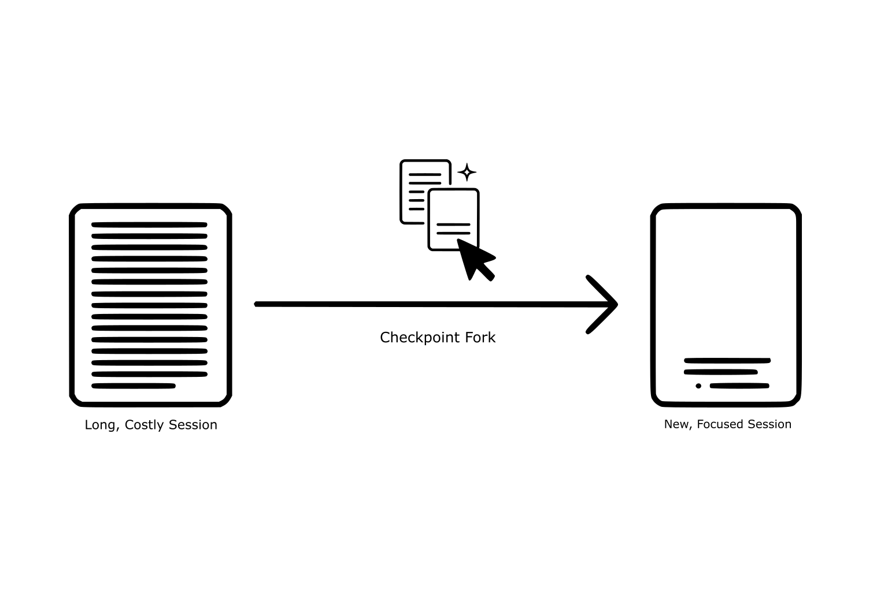

# The Checkpoint Fork

**A proposed feature to fix a systemic failure in the user experience of major Large Language Models (LLMs).**

This repository contains the open-source assets (licensed under CC BY 4.0) for the Checkpoint Fork concept, designed to improve user retention, reduce computational waste, and give power users critical control over long-running AI sessions.

---

### The Problem

There's a systemic failure in the UX of major LLMs that is actively wasting money and frustrating power users.

-   **For Users:** Deep, multi-turn sessions require manual summarization to manage context limits. This offloads a core system responsibility onto the user, creating friction and killing innovation.
-   **For Business (FinOps):** Every turn in a long-running, degraded session has a compounding computational cost. Continuing that session is a direct waste of the cloud budget.

### The Solution: The Checkpoint Fork

The Checkpoint Fork is an elegant escape hatch that gives users control and offers businesses a proactive cost-management tool.

Here is the simple, user-initiated workflow:
1.  **Initiate the Fork:** When a session becomes long or unfocused, the user clicks the **Checkpoint Fork** button to prevent context degradation.
2.  **Guide the Summary (Optional):** An option appears, allowing the user to provide a specific focus for the new session's narrative.
3.  **Start the New Session:** A new, focused session is created, beginning with a high-fidelity summary that preserves all critical code, data, and other artifacts from the previous conversation.

This simple process improves user retention and provides a direct, positive impact on a company's cloud budget.

### Project Assets

This repository provides all the assets needed for implementation:

*   **[The Icon (SVG)](icon.svg)**: The clean, scalable vector icon for the feature.
*   **[The Workflow Diagram (SVG)](workflow.svg)**: The diagram illustrating the concept.
*   **[The Production-Ready Prompt Logic](PROMPT.md)**: The detailed system prompt engineered for high-fidelity artifact preservation.

### License

This entire concept and all associated assets are released under the [Creative Commons Attribution 4.0 International License](LICENSE). You are free to share and adapt this for any purpose, even commercially, as long as you give appropriate credit.
